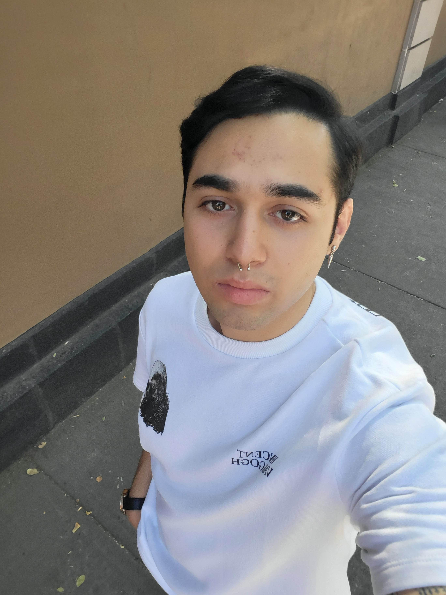

## Javier Emilio Alvarez Reyes

## Rol: Desarrollador

### Actividades: Ir provando pormpts para ver cual es el que mejor funciona.
- Con base a las IA´s dadas por el profesor hice un prototipo de como es que debe quedar nuesttro juego las ias que use fueron Firebase studio y Replit

## Daniel Alberto Solano Noyola

## Rol: Lider

### Actividades: Lider y administrador del repositorio

## Diego Alejandro Caceres Cabello

## Rol: Diseñador full Stack.
- Creación mediante IA´S Lovable y Google IA Studios , dandole las nuevas reglas y la base del juego de mesa , con ciertas especificaciónes ectras , no se podía compartir la conversación de Gooogle así que se adjunto en un word con pruebas 

### Actividades: Crear el figma y ver la parte del diseño. 
- Creación mediante las IA´s Stich y Figma Make, de dos "bpcetos/ideas" de como puede quedar nuestro juego en una página web, con una interfaz aceptable y una buena jugabilidad.
